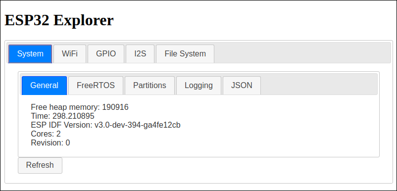
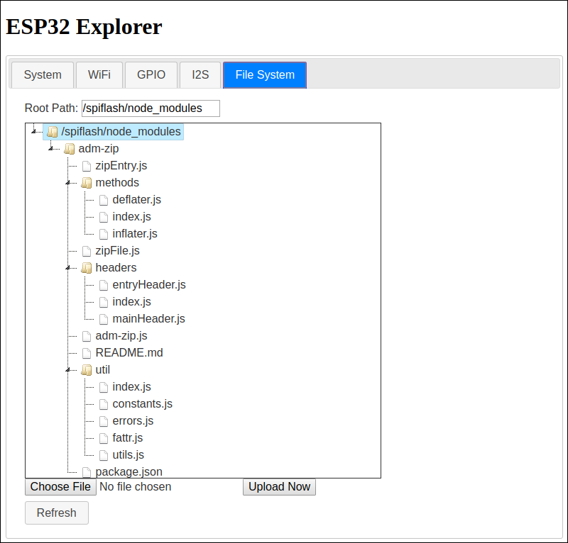

## ESP32 Explorer

** WARNING!! - VERY EARLY CODE **

A utility library / application for investigating the ESP32.

Locked within an ESP32 at runtime is a wealth of information.  This includes:

* Your availabile memory
* Your WiFi connections
* Your GPIO status
* The files on your flash file system
* The status of your logging enablement
* The partitions in use
* The state of FreeRTOS tasks
* and *much* more ...

As I wrote applications to run on the ESP32, I found that from time to time I would need this information or wish to tweak some settings at runtime.  I would inject code into my application, perform those tests and then remove it.  As I wrote more applications, I found that I was repeating these steps over and over again.  This notion became the kernel of this project.

The purpose of the project is to produce a library which, when linked with your own application can reveal the content of your ESP32 at runtime **and** allow you to tweak settings.

When linked with your application, it will start listening as a network endpoint (an HTTP server) to accept external calls for information and receive external calls to change state and data.  In addition to the library you link with your ESP32 app, there is a web page that can be opened which presents the information in a series of tabbed pages.

 

Some pages have additional tabs on them.

## File System
The File System page shows the file system found on the ESP32.  From here you can see if the files you expect to be available are present.  You also have the opportunity to upload new and updated files.

 